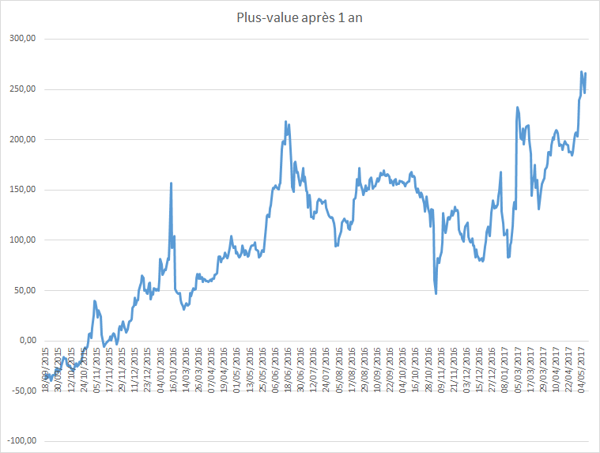
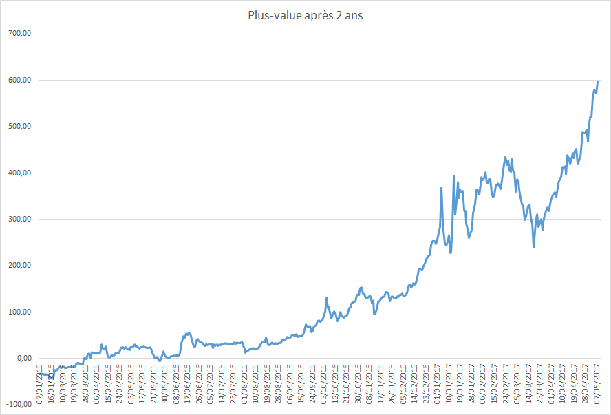
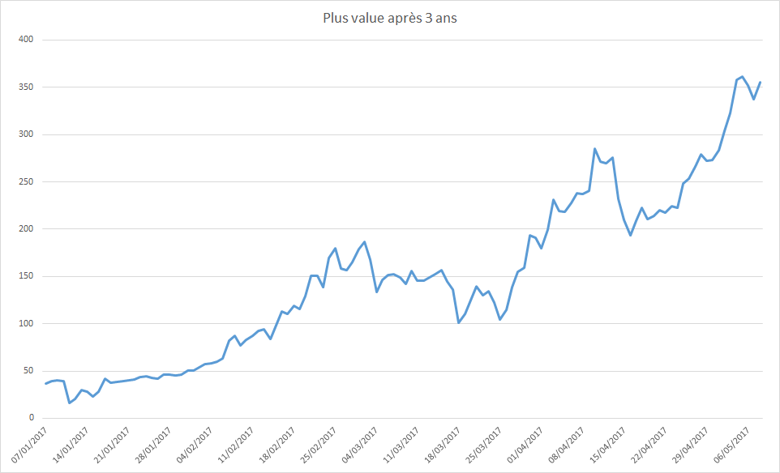

# Speculer sur le bitcoin ?
Ca aurait donné quoi de spéculer sur l'achat de 100€ de bitcoins il y a 1, 2 ou 3 ans ? 

Voici les résultats d'un script qui calcule le montant de bitcoins achetable avec 100€ et regarde la plus value (ou moins value) après revente de ce montant en bitcoin 1,2 ou 3 ans après l'achat.

(NB: du coup, les valeurs peuvent être vues comme des pourcentages).

Les valeurs prises sont issues des données de la place de marché Kraken.
